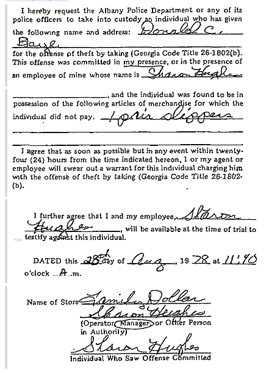

# Daye v. City of Albany

\[Note: Edited from the [<mark style="color:blue;">original</mark>](https://www.courtlistener.com/opinion/8886859/daye-v-city-of-albany/).]

***

496 F. Supp. 1227 (M.D. Ga. 1980)

Middle District of Georgia

**Daye**\
**v.**\
**City of Albany**

## Opinion

OWENS, Chief Judge:

The Fourteenth Amendment to the Constitution of the United States provides that:

> Section 1. All persons born or naturalized in the United States, and subject to the jurisdiction thereof, are citizens of the United States and of the state wherein they reside. No State shall make or enforce any law which shall abridge the privilege or immunities of citizens of the United States; nor shall any State deprive any person of life, liberty, or property, without due process of law; nor deny to any person within its jurisdiction the equal protection of the laws.

Under this amendment Congress enacted a law numerically designated as [42 U.S.C.A. § 1983](https://cite.case.law/citations/?q=42%20U.S.C.%20%C2%A7%201983) which provides:

> Every person who, under color of any statute, ordinance, regulation, custom, or usage, of any State or Territory, subjects, or causes to be subjected, any citizen of the United States or other person within the jurisdiction thereof to the deprivation of any rights, privileges, or immunities secured by the Constitution and laws, shall be liable to the party injured in an action at law, suit in equity, or other proper proceeding for redress.

\[...]

Pursuant to that amendment and those congressionally enacted laws, plaintiff Don Daye sued the City of Albany alleging that a city police officer acting pursuant to an official City of Albany policy, arrested and imprisoned him without probable cause to believe that he had committed a crime thereby depriving him of his constitutional rights and damaging him.

On February 28, 1980, the court without a jury heard the evidence and argument of counsel and made a preliminary ruling ... This now constitutes the court’s findings of fact and conclusions of law setting forth in greater detail the court’s ruling. \[...]

Where an arrest warrant has not been issued, a law enforcement officer may not arrest a person unless he has probable cause to believe the person had committed or was committing a crime. “Probable cause exists ‘if the facts and circumstances within \[the enforcement officers] knowledge and of which they had reasonably trustworthy information were sufficient to warrant a prudent man in believing that the . . . \[person] had committed or was committing an offense.’\*

> The determination of probable cause does not rest upon a technical framework; instead it depends On the factual and practical considerations of everyday life on which reasonable and prudent men, not legal technicians, act.\*

_Ellis v. Zieger,_ [449 F.Supp. 25](https://cite.case.law/citations/?q=449%20F.%20Supp.%2025), 26 (E.D. Wis. 1978).

When a police officer or in this case a city, is sued under [42 U.S.C.A. § 1983](https://cite.case.law/citations/?q=42%20U.S.C.%20%C2%A7%201983) for unconstitutional arrest, the defense of good faith and probable cause is available to the officer and the city.[\* ](#user-content-fn-1)[^1]Then “\[t]he test is not whether the arrest was constitutional or unconstitutional or whether it was made with or without probable cause. Rather, the issue is whether the police officer believed in good faith that the arrest was made with probable cause and whether the belief was reasonable.\*

Petitioner Donald Daye then working as a roofer on an Alabama job spent the weekend of August 25, 1978, visiting in Albany, Georgia. With a friend he went shopping in a Family Dollar Store located on the Sylvester Expressway in East Albany. As Mr. Daye was leaving the store, the manage&#x72;_,_ Sharon Hughes, asked Mr. Daye if he intended to pay for the shoes he was wearing, and Mr. Daye replied that the shoes were his, having been purchased earlier from another store. The shoes were brown corduroy with black rubber soles which were similar to shoes sold by Family Dollar for $3.99. Mr. Daye took off one shoe and held it up for Ms. Hughes to see its worn condition. Ms. Hughes suggested that Mr. Daye came in barefoot and continued to assert the belief that he must pay for the shoes. Mr. Daye asked Ms. Hughes to call the Police and Ms. Hughes in turn requested another store employee who had no direct knowledge of the incident, to telephone the police. She did, and as a result officer David Robbins arrived some 40 minutes later in response to the dispatcher’s radio instructions to investigate a shoplifting incident. During the time it took the officer to respond, Mr. Daye voluntarily waited near the front of the store. Neither Ms. Hughes nor any other person even attempted to restrain him from departing even though at the time the laws of Georgia arguably would have authorized Ms. Hughes as a private person under these circumstances to arrest him, to wit:

> 27-211 (921 P.C.) Arrest by private person

> A private person may arrest an offender, if the offense is committed in his presence or within his immediate knowledge; and if the offense is a felony, then the offender is escaping, or attempting to escape, a private person may arrest him upon reasonable and probable grounds of suspicion.

1933 Ga. _Code Ann._

In accordance with a written memorandum from Police Chief Summerford which provided:

> August 14, 1974
>
> _MEMORANDUM_
>
> TO: All Personnel
>
> PROM: Chief Leslie Summerford
>
> SUBJECT: (Shoplifting) - Theft by Taking, Georgia Code 26-1802 (Section B, Paragraph 4)
>
> Our policy in handling shoplifting cases, which is backed by the City Attorney and the City Commission, is listed below:
>
> When you are called by a merchant to a store on a shoplifting case, have the person in charge of the business to fill out a shoplifting form and take custody of the shoplifter and bring him to the Station.
>
> Book the shoplifter and take a copy of the signed shoplifting form and the shoplifter to the Sheriff’s Office and turn both over to them. We retain the original of the signed shoplifter form.
>
> _Be sure to have the form filled out completely._
>
> If a merchant calls concerning a shoplifter and the shoplifter is leaving pr has left the establishment, detain subject and then have the merchant sign the shoplifting form.
>
> /s/ Leslie Summerford Chief Leslie Summerford
>
> LS/sm
>
> I have read the above memorandum on Shoplifting, and I fully understand it.
>
> Sign below:

Albany police officers in general and Officer Robbins in particular, upon receiving a call that a shoplifting incident had occurred, had been going to the place where the shoplifting allegedly occurred, interviewing the complainant, getting the complainant to sign a written form,[1](https://cite.case.law/f-supp/496/1227/#footnote_1_1) taking the accused into custody, transporting the accused to the county jail and leaving him in the Sheriff’s custody. In each instance if the accused was present with the complainant, Officer Robbins upon being advised by the complainant that the accused shoplifted, assumed without asking that the accused had already been arrested pursuant to § 27-211 \[a state statute permitting citizen arrests in specific circumstances]. \[Even though that statute had been effective since March 23, 1977, it was not included in the city’s written instructions to its police officers and was not utilized by its police officers.] Before this incident, \[Officer Robbins] had handled some 75 to 100 shoplifting complaints in this manner.

\[...]

When Officer Robbins arrived at the Family Dollar Store, Mr. Daye and Ms. Hughes were standing in front on a concrete open air covered walkway. The officer was told by Ms. Hughes that Mr. Daye had been barefoot upon entering the store, had been seen stopping at a table where similar brown shoes are displayed for sale, and had been observed about to leave the store with brown shoes on his feet and without having paid for the shoes. Mr. Daye advised that he had purchased the shoes on a prior occasion from another store, did not take them from this store and did not owe for them. Mr. Daye took off the shoes, the officer looked at them, and as the bottoms clearly show, they were not new in appearance.

Without asking whether or not Mr. Daye had been arrested by Ms. Hughes, Officer Robbins in accordance with his instructions got Ms. Hughes to sign the usual form,[2](https://cite.case.law/f-supp/496/1227/#footnote_1_2) took Mr. Daye into custody and transported him to the county jail. There Mr. Daye was left in custody of the Sheriff.

Mr. Daye was left in the county jail sometime Saturday afternoon. Officer Robbins neither then nor later did anything to comply with his statutory duty to cause Mr. Daye “without delay” to be taken “before the most convenient officer authorized to receive an affidavit and issue a warrant . . .” \[...] That officer-a judge or justice of the peace-would have held a court of inquiry to examine into the accusation against Mr. Daye and if the inquiry were postponed to a later day, would have permitted Mr. Daye to exercise his statutory right to give bail and thereby be released from the county jail pending a later hearing. \[...]

Mr. Daye was confined for approximately two days in the county jail without an arrest warrant having been issued and without having been taken before a judicial officer. After approximately two days Ms. Hughes appeared and signed an affidavit alleging that Mr. Daye on August 26 committed the offense of theft by taking (shoplifting) one pair of $3.99 bedroom slippers from the Family Dollar Store. The affidavit is dated August 28 and the resulting arrest warrant is dated August 28. Some five days later Mr. Daye appeared before a judicial officer, made bail and was released.

At the time of his arrest and incarceration on August 26, Mr. Daye had several hundred dollars in his possession. Had he been promptly taken before a judicial officer for bail to be set for the accusation of $3.99 shoplifting, it is obvious he could have made bond with the money in his pocket.

On December 11, 1978, a jury of the State Court of Dougherty County found Mr. Daye not guilty of shoplifting.

What relief is Mr. Daye entitled to in this court under 42 U.S.C.A., § 1983 on account of having been arrested without a warrant and held for some two days without being taken before a judicial officer and without an arrest warrant having issued?

Officer Robbins and "the City of Albany first contend that the city and its officer did nothing more than take custody of Mr. Daye after he had been arrested[3](https://cite.case.law/f-supp/496/1227/#footnote_1_3) by Ms. Hughes, the store manager, for shoplifting. \[T]his contention fails because as a matter of fact, Ms. Hughes did not arrest or detain Mr. Daye; did not even tell Mr. Daye that he was under arrest or was being detained for shoplifting; and did not tell Officer Robbins verbally or by signing the city’s form,[4](https://cite.case.law/f-supp/496/1227/#footnote_1_4) that she had arrested Mr. Daye. The form does not say “I have arrested Donald C. Daye for the offense of theft by taking, etc.” It only says “I hereby request the Albany Police Department or any of its police officers to take into custody .. . .” Neither did the overall circumstances in which Mr. Daye was observed by Officer Robbins indicate to Officer Robbins that Mr. Daye had already been arrested by Ms. Hughes. At best Officer Robbins just assumed that Mr. Daye had been arrested by Ms. Hughes. Neither the law nor the Constitution authorize an arrest on account of an unfounded assumption that a private citizen has already effected an arrest for shoplifting.

The next contention of the City and its officer is that even if Ms. Hughes had not arrested Mr. Daye, what Ms. Hughes told the officer coupled with the officer’s observation of Mr. Daye, the shoes and the store setting, was sufficient to warrant Officer Robbins in good faith and as a reason able and prudent man, in believing that Mr. Daye had committed the offense of shoplifting, and in believing that he therefore had the good faith probable cause that is a defense to this § 1983 action, to arrest Mr. Daye. Assuming that a police officer is constitutionally authorized to arrest without a warrant on a misdemeanor—a proposition which is extremely doubtful in light of what the Supreme Court said in [_United States v. Watson_](#user-content-fn-2)[^2]—were it not for the obviously used condition of the new $3.99 shoes that Mr. Daye was accused of taking and that Officer Robbins looked at, this court would agree that this officer himself could have had probable cause to arrest Mr. Daye. Those shoes, however, viewed in the light of the “factual and practical considerations of everyday life on which reasonable and prudent men, not legal technicians, act . . .”[\* ](#user-content-fn-3)[^3]were in such a used condition that regardless of what Ms. Hughes told the officer, the officer as a matter of common sense could not have believed Mr. Daye had taken a pair of new $3.99 shoes and thereby committed the offense of shoplifting. The officer himself did not have good faith probable cause to arrest Mr. Daye for shoplifting.

What then was the basis for Mr. Daye being arrested and taken to the county jail? The whole basis for the arrest, the entire cause of Officer Robbins taking Mr. Daye into his custody and delivering Mr. Daye to the county Jail—in truth and fact—was the August 14, 1974, policy of the City of Albany which the officer obeyed and which told him:

> When you are called by a merchant to a store on a shoplifting case, have the person in charge of the business to fill out a shoplifting form and _take custody of the shoplifter_ and _bring him to the station._

> Book the shoplifter and _take_ a copy of the signed shoplifting form and _the shoplifter to the Sheriff’s Office and turn both over to them._ We retain the original of the signed shoplifter form.

> _Be sure to have the form filled out completely._

> If a merchant calls concerning a shoplifter and the shoplifter is leaving or has left the establishment, detain subject and then have the merchant sign the shoplifting form.

(Emphasis added).

This in reality told Officer Robbins that you don’t have to determine whether or not a merchant has arrested a shoplifter; you don’t have to determine whether or not you have probable cause to arrest a shoplifter; you don’t have to follow the commands of Georgia law to take every person arrested without a warrant, before a judicial officer without delay. All you have to do is follow the city policy.

This city policy eliminated the constitutionally derived right of Mr. Daye and all other persons to be free from arrest without a warrant by a police officer except in those instances in which the police officer has probable cause to believe the person had committed or was committing a crime. This city policy caused this city police officer to arrest Mr. Daye and deliver him into the custody of the Sheriff of Dougherty County. Mr. Daye by being arrested in this manner, delivered into the Sheriff’s custody, and further detained, was deprived of his constitutional rights. Pursuant to [42 U.S.C.A. § 1983](https://cite.case.law/citations/?q=42%20U.S.C.%20%C2%A7%201983), he is thus entitled to be awarded damages.

\[...]

SO ORDERED.

## \[Footnotes]

[1](https://cite.case.law/f-supp/496/1227/#ref_footnote_1_1) The form in question provides:

<figure><figcaption></figcaption></figure>

[2](https://cite.case.law/f-supp/496/1227/?highlight=The+form+in+question+provides%3A#ref_footnote_1_2) See Footnote 1.

[3](https://cite.case.law/f-supp/496/1227/?highlight=The+form+in+question+provides%3A#ref_footnote_1_3) The word “arrest” means: “To deprive a person of his liberty by legal authority. Taking, under real or assumed authority, custody of another for the purpose of holding or detaining him to answer a criminal charge or civil demand. _Ex parte Sherwood,_ [29 Tex.App. 334](https://cite.case.law/citations/?q=29%20White%20%26%20W.%20334), [_15_ ](https://cite.case.law/citations/?q=15%20S.W.%20812)[S.W. 812](https://cite.case.law/citations/?q=15%20S.W.%20812). Physical seizure of person by arresting officer or submission to officer’s authority and control is necessary to constitute an ‘arrest.’ _Turney v. Rhodes,_ [42 Ga.App. 104](https://cite.case.law/ga-app/42/104/), [155 S.E. 112](https://cite.case.law/citations/?q=155%20S.E.%20112). It is the taking, seizing or detaining the person of another, touching or putting hands upon him in the execution of process, or any act indicating an intention to arrest.” Black’s Law Dictionary, Revised Fourth Edition.

[4](https://cite.case.law/f-supp/496/1227/?highlight=The+form+in+question+provides%3A#ref_footnote_1_4) See Footnote 1.

[5](https://cite.case.law/f-supp/496/1227/?highlight=The+form+in+question+provides%3A#ref_footnote_1_5) [42 U.S.C.A. § 1988](https://cite.case.law/citations/?q=42%20U.S.C.%20%C2%A7%201988).

[^1]: Scheuer v. _Rhodes,_ [416 U.S. 232](https://cite.case.law/us/416/232/), [94 S.Ct. 1683](https://cite.case.law/us/416/232/), [40 L.Ed.2d 90](https://cite.case.law/us/416/232/) (1974); _Pierson v. Ray,_ [386 U.S. 547](https://cite.case.law/us/386/547/), [87 S.Ct. 1213](https://cite.case.law/us/386/547/), [18 L.Ed.2d 288](https://cite.case.law/us/386/547/) (1967)

[^2]: [423 U.S. 411](https://cite.case.law/us/423/411/#p418), 418, [96 S.Ct. 820](https://cite.case.law/us/423/411/#p418), [46 L.Ed.2d 598](https://cite.case.law/us/423/411/#p418) (1976)

[^3]: _Ellis v. Zieger,_ [_supra_ ](https://cite.case.law/citations/?q=449%20F.%20Supp.%2025)[at 26](https://cite.case.law/citations/?q=449%20F.%20Supp.%2025)
