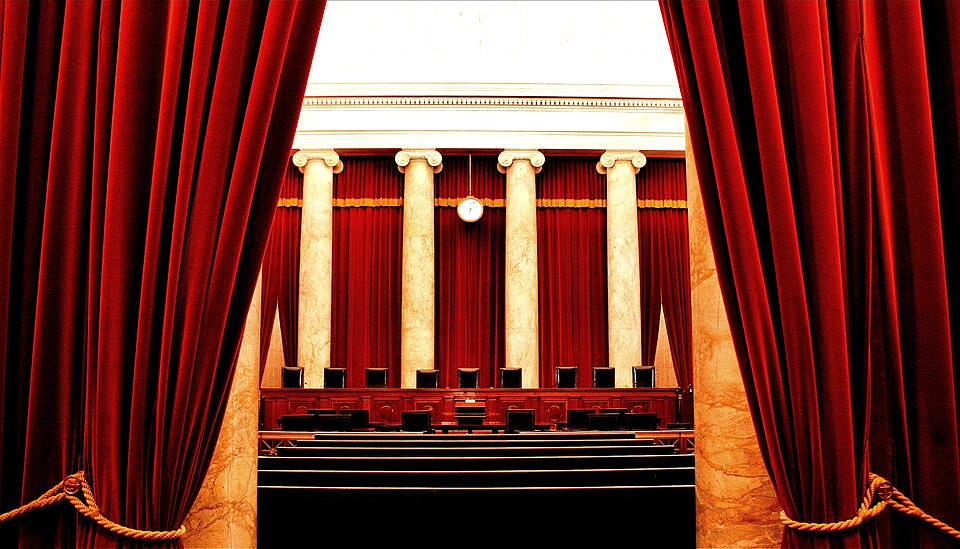

# The United States Court System

<figure><figcaption>
"Inside the United States Supreme Court" by <a href="https://www.flickr.com/people/88876166@N00">Phil Roeder</a> is licensed CC BY 2.0)
</figcaption></figure>

***


**LEARNING OBJECTIVES 🎯**

1. Identify the three federal branches of government and their roles.
2. Explain how law and government interact to make, enforce, and interpret law.
3. Define federalism and distinguish delegated federal powers from reserved state powers.
4. Explain the concept of jurisdiction and how subject matter jurisdiction applies to state and federal legal issues.
5. Distinguish trial courts from appellate courts, including records on appeal and limits on review.


***

## Contents




[introduction.md](introduction.md)





[separation-of-powers.md](separation-of-powers.md)





[federalism.md](federalism.md)





[trial-and-appellate-courts.md](trial-and-appellate-courts.md)



