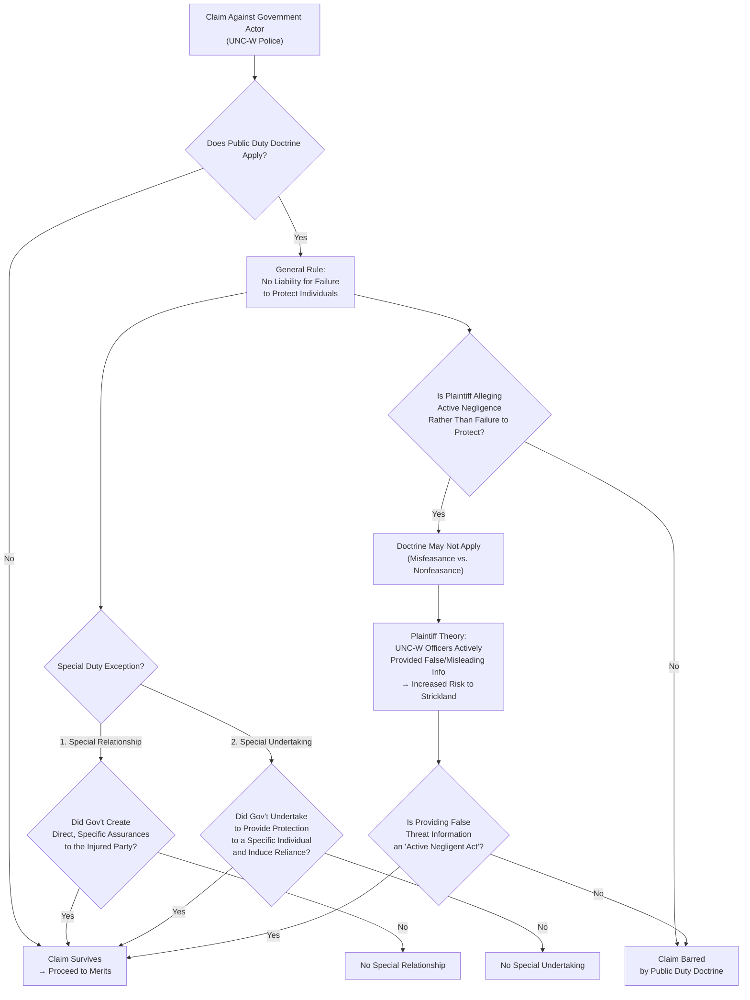

# Strickland v. University of North Carolina

\[Note: Edited from the [<mark style="color:blue;">original</mark>](https://scholar.google.com/scholar_case?case=5287003085729716521\&hl=en\&as_sdt=6,50).]

***

_Strickland v. University of North Carolina_, 712 S.E.2d 888 (N.C. Ct. App. 2011)

## **Facts**

* The University of North Carolina at Wilmington (UNC-W) police were investigating Strickland as a suspect with an assault and theft on campus.
  * Concluded that serving arrest warrant would be potentially dangerous, so it sought help from the New Hanover County Sheriff's Dept. Emergency Response Team (ERT).
* UNC told ERT:
  * Strickland was known to be armed and dangerous
  * Strickland had been engaged in gang activity
  * Strickland had been involved in two previous assaults.
* When serving warrant, ERT officer shot and killed Strickland.
* ERT officer who shot Strickland described it as a “severely dangerous environment including heavily armed suspects with histories of intentional physical violence causing injuries to persons.” &#x20;
* The officer mistakenly believed gunfire sounds were coming from within Strickland's home when they were actually from a battering ram used on the door.&#x20;
* Donald Ray Strickland, the victim’s father, filed a wrongful death claim against UNC-W and its police department, accusing them of **negligently providing false information** about his son to the authorities, which he argues led to his son’s death.&#x20;
* UNC-W officers had two arguments:
  * the public duty doctrine applies.
  * they weren't the direct cause because they didn't fire the shot that killed the victim

## **Issue**

Whether the public duty doctrine applies.&#x20;

## Holding

No.

## Rule

* Public Duty Doctrine
  * When a governmental entity owes a duty to the general public, individual plaintiffs may not enforce the duty in tort.
  * There is no general "duty to protect" a specific individual; an officer's duty is to protect the public. But there are two exceptions:
  * **Exceptions:**
    1. where there is a special relationship between the injured party and the police (for example, a state’s witness or informant who has aided law enforcement officers); and&#x20;
    2. when a municipality, through its police officers, creates a special duty by promising protection to an individual, the protection is not forthcoming, and the individual’s reliance on the promise of protection is causally related to the injury suffered.

## Analysis

* Plaintiff's allegations describe a duty **to provide accurate information related to a specific individual (i.e., an identifiable member of the public**, not the general public, and it doesn't involve an external injurious force that threatened the individual).
* Although UNC-W police officers **may not have been the last link in the chain of causation, they were the impetus for the injurious force that&#x20;**_**brought about**_**&#x20;the ERT member’s decision to fire** his weapon through Strickland’s door.&#x20;
* **Proximate cause**
  * where the breach is the first link in a multi-link chain of causation, the "direct cause" doesn't need to be the last link:
    * negligent provision of inaccurate information → high state of alarm → battering ram mistaken for a gunshot → officer fires weapon → killed Strickland to die&#x20;
      * By providing the information to the ERT, UNC-W police **assumed an affirmative duty**, and **breaching the duty (negligently providing inaccurate information) directly caused Strickland’s death**.

